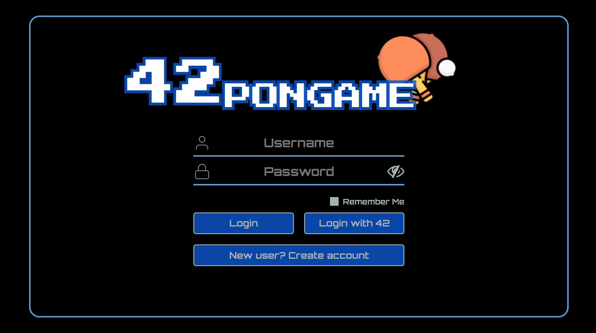
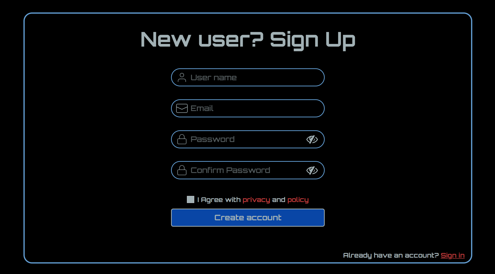
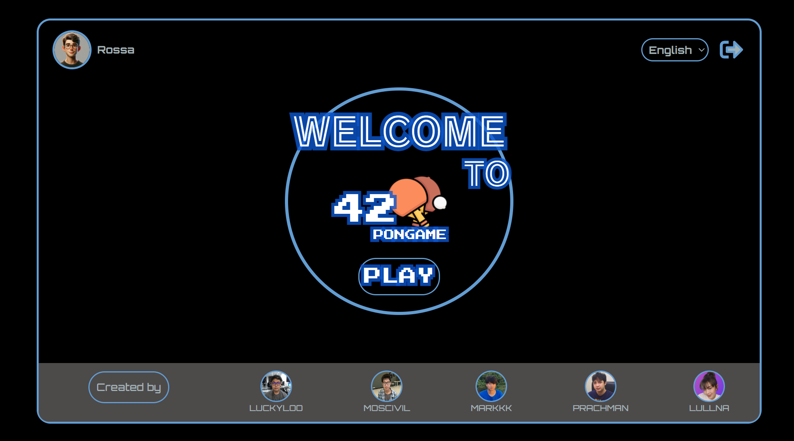
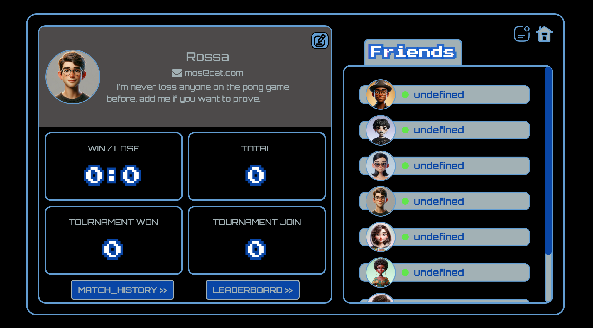
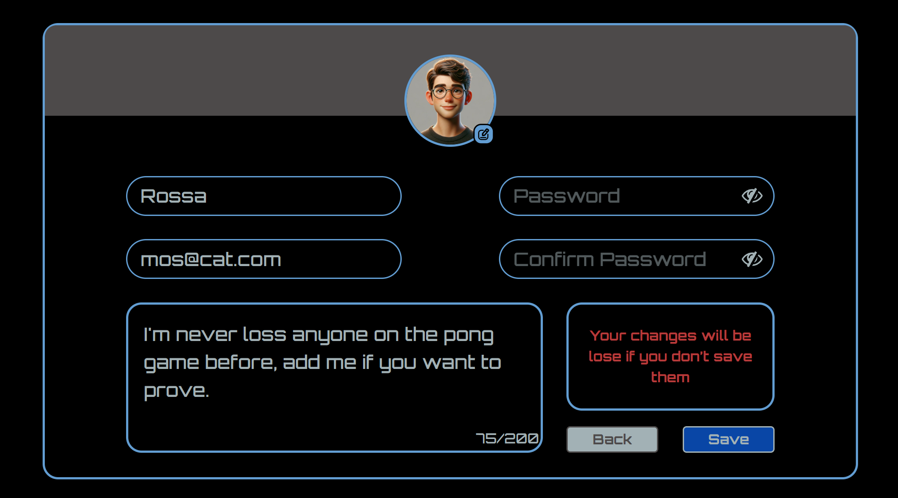

# The Project is in progress...

# transcendence
> This project aims to develop a single page application with the following features:
> - Account Management System: Users can create, manage, and update their accounts.
> - Friend List: Users can add and manage friends within the application.
> - Online Multiplayer Pong Game: Users can play a real-time, online multiplayer version of the classic Pong game.
> - Match History: Users can view the history of their matches, including scores and opponents.
## Previews
### Account Pages
|    
**Login Page**
 |    
**Signup Page**
 |
| :-: | :-: |
|    
**Main Page**
 |    
**Profile Page**
 |
|    
**Edit Profile Page**
 | |

---
## 🛠️Built with
* Django: Python web framework for creating back-end APIs.
* Bootstrap: Library for making responsive front-end designs.
* PostgreSQL: Object-relational database management system.
* NGINX: HTTP server for serving web pages.

---
## 📝How to build
1. create file .env from .env.sample
2. use make at /project/makefile run `docker compose up --build`

---
## ELK
1. uncomment in
    - docker-compose.yaml (include elk compose)
    - docker-compose.yaml (backend service - depends_on: logstash)
    - settings.py (LOGGING)
2. access Kibana
    - url: https://localhost:{kibana-port}
    - user: elastic
    - password: es1234